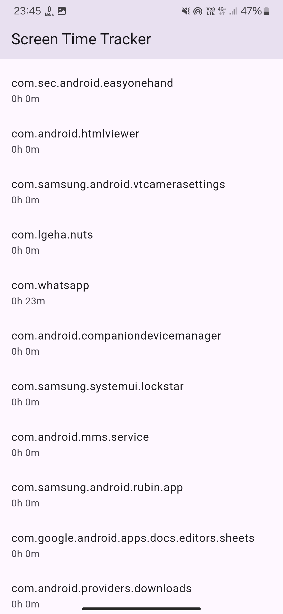
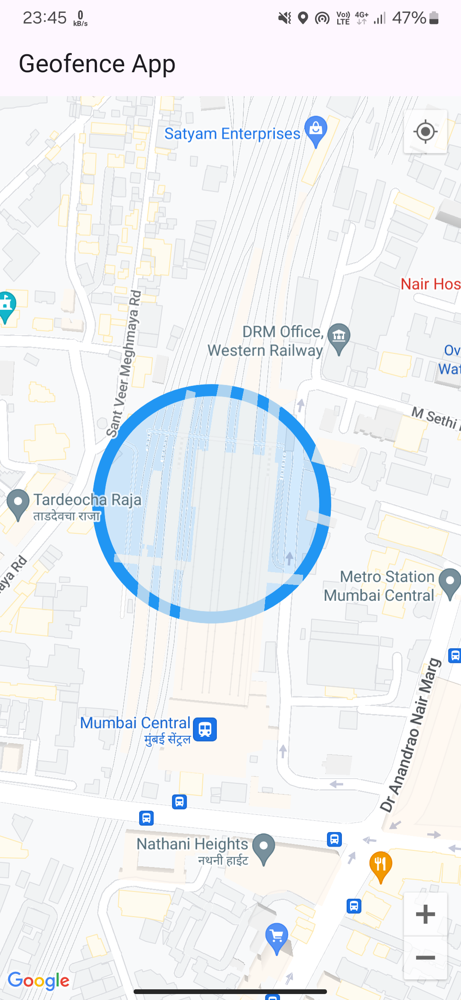
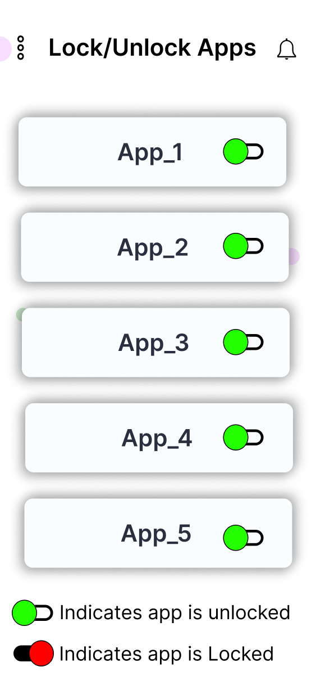
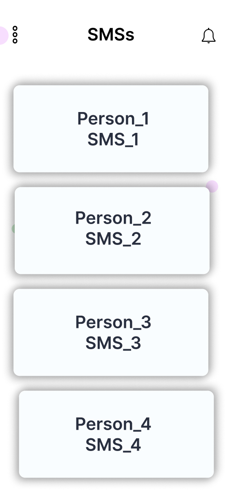
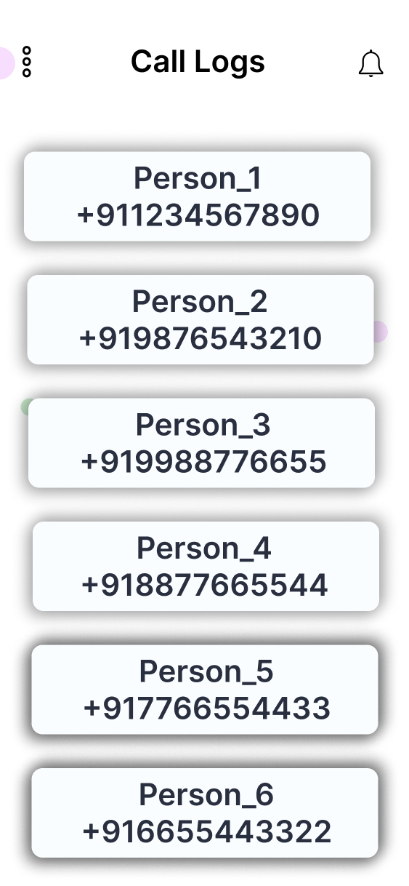

# Custodify

Custodify is a parental control app designed to help parents monitor their child's smartphone activity seamlessly and securely. It provides a suite of features that allow parents to track, manage, and restrict specific phone functions to promote safe and responsible smartphone usage.
___
## Features

### Completed
*Note: The screenshots shown here are from the alpha version. UI improvements will be implemented in future updates.*
1. **App List Tracker** - View all apps installed on the child’s phone.

2. **Live Location Tracking** - Real-time location updates of the child’s device.
3. **Geofencing** - Set boundaries, and receive alerts when the device enters or leaves specific zones.

___
### In Progress
1. **Remote App Lock** - Remotely restrict access to specific apps.
2. **Remote Phone Lock** - Lock the child’s phone remotely if needed.
3. **SMS Tracker** - Monitor SMS activity.
4. **Contacts Tracker** - View the contacts saved on the child’s device.
5. **Call Logs Tracker** - Keep track of incoming and outgoing calls.
___
### Future Plans
1. **Browser History Tracking** - Monitor websites accessed.
2. **Website Blocking** - Restrict access to specific websites across browsers.
3. **Offline Functionality** - Enable limited app functionality without internet access.
___
## Screenshots of UI

___
## Project Status
Currently, I have my exams ongoing, but the project is expected to be completed by the end of January 2025.(hopefully)

